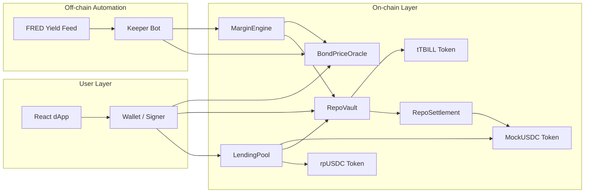
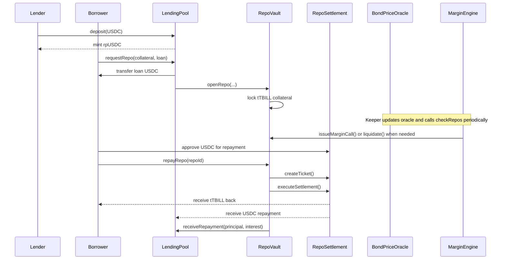
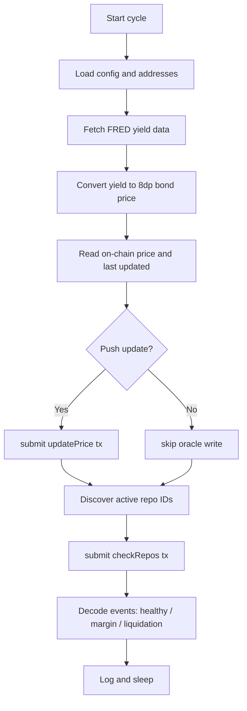

# Decentralized Tokenized Repo System

An end-to-end protocol for on-chain repo lending using tokenized T-Bill collateral, with lender share accounting, atomic settlement, automated risk checks, and a live frontend dashboard. This repository combines three layers in one place:

1. Smart contracts for collateralized lending and liquidation workflows.
2. A React dApp for lenders, borrowers, and admin operators.
3. A Python keeper and risk engine for oracle updates and margin monitoring.

The result is a full-stack reference implementation of a modern repo desk where core lifecycle events (deposit, borrow, repay, margin call, liquidation) are verifiable on-chain.

## Table of Contents

1. Project Vision
2. Why This Protocol Exists
3. Architecture Overview
4. System Components
5. Core Contract Design
6. Repo Lifecycle
7. Risk Management Model
8. Protocol Math Reference
9. Oracle and Keeper Flow
10. Frontend Application
11. Repository Structure
12. Local Setup
13. Contract Deployment and Seeding
14. Running the Frontend
15. Running the Keeper Bot
16. Testing Strategy
17. Data, Notebooks, and Quant Modules
18. Current Limitations and Known Gaps
19. Security and Operational Notes
20. Recommended Production Hardening
21. Contributing

## Project Vision

Traditional repo markets rely on centralized intermediaries, fragmented collateral systems, delayed settlement windows, and opaque operational controls. This project explores what happens when you recreate the repo market primitive in a programmable stack:

- Collateral exists as a transferable token.
- Loan accounting and lender shares are deterministic.
- Delivery-versus-payment is enforced at transaction level.
- Margin surveillance is objective and on a fixed ruleset.
- End users can inspect state directly from contracts.

At a conceptual level, this repository is both:

- A practical prototype you can run end-to-end.
- A design thesis for how fixed-income rails can be made transparent and automated.

## Why This Protocol Exists

In a repo transaction, a borrower receives cash today and posts high-quality collateral. They later repay cash plus interest and reclaim collateral. The key operational risks in conventional systems are:

- Settlement risk: one leg of a trade settles while the other leg fails or is delayed.
- Counterparty risk amplification: collateral values move before risk desks can react.
- Operational lag: manual checks, fragmented systems, and delayed reconciliation.

This codebase addresses those with clear mechanisms:

- Atomic DVP via `RepoSettlement`.
- Deterministic LTV monitoring in `MarginEngine`.
- Programmatic margin call and liquidation flow in `RepoVault`.
- Automated off-chain keeper cycle that updates oracle state and checks active repos.

## Architecture Overview

The architecture below mirrors the shared system diagram and captures contract responsibilities and directional flow.

```mermaid
flowchart TB
		U[USERS<br/>Lender | Borrower]

		LP[LendingPool<br/>- mints/burns rpUSDC shares<br/>- tracks totalLoaned<br/>- sharePrice grows with interest]

		RV[RepoVault<br/>- locks tTBILL collateral<br/>- stores RepoPositions<br/>- handles repay + margin calls]

		ME[MarginEngine<br/>- monitors LTV<br/>- triggers margin calls and liquidation]

		RS[RepoSettlement<br/>- atomic DVP<br/>- tTBILL <-> USDC settlement legs]

		OR[BondPriceOracle<br/>- stores latest tTBILL price<br/>- owner-updated by keeper bot]

		KB[Python Keeper Bot<br/>every cycle: fetch yield -> push oracle -> check repos]

		U -->|deposit()| LP
		U -->|requestRepo()| LP
		LP -->|openRepo()| RV
		RV -->|createTicket()/executeSettlement()| RS
		RV -->|issueMarginCall()/liquidate()| ME
		ME -->|read price| OR
		KB -->|updatePrice()| OR
		KB -->|checkRepos()| ME
```

### Layered View



## System Components

### Smart Contract Domain

1. `LendingPool`
- Accepts USDC deposits from lenders.
- Mints and burns `rpUSDC` shares.
- Issues repo loans to borrowers.
- Tracks `totalLoaned` to keep pool accounting correct.
- Receives repayment/liquidation credits from `RepoVault`.

2. `RepoVault`
- Stores the canonical repo positions (`RepoPosition`).
- Pulls and locks borrower tTBILL collateral.
- Handles repayment workflow and collateral return.
- Handles margin calls and liquidation state transitions.

3. `MarginEngine`
- Evaluates LTV using live oracle prices.
- Triggers margin calls at threshold breach.
- Triggers liquidations on critical breach or expired margin call.

4. `RepoSettlement`
- Creates settlement tickets.
- Executes atomic DVP for repayment settlement.
- Ensures two-leg transfer is all-or-nothing.

5. `BondPriceOracle`
- Stores last pushed tTBILL price (8 decimals).
- Rejects stale reads beyond configured threshold.
- Is written by the owner account (keeper operator).

6. Tokens
- `MockTBill`: KYC-gated ERC20-like collateral token (18 decimals).
- `MockUSDC`: mocked cash token using the same `MockTBill` contract pattern.
- `RepoPoolToken` (`rpUSDC`): lender share token, mint/burn restricted to pool.

### Frontend Domain

The frontend is a React app with Wagmi/Web3Modal integration and has pages for:

- Dashboard: protocol metrics and charts.
- Lend: deposit and withdraw workflows.
- Borrow: open repo, repay, and margin top-up actions.
- Portfolio: wallet balances plus position history.
- Admin: oracle update, minting, KYC granting, diagnostics.

The UI polls live contract data and maintains chart history in local storage for continuity across reloads.

### Keeper and Risk Domain

`risk_engine/keeper` provides production-style automation loops:

- Reads FRED yield data.
- Converts yield to implied T-Bill price.
- Smooths updates to reduce oracle noise.
- Pushes on-chain price when threshold logic indicates.
- Executes `MarginEngine.checkRepos` over active repos.
- Decodes emitted events to classify healthy, margin call, and liquidation outcomes.

## Core Contract Design

### `LendingPool`: Share-Accounting Core

Key ideas:

- Lenders receive `rpUSDC` shares when they deposit.
- Shares represent proportional claim on `totalPoolValue`.
- `sharePrice` rises when interest enters pool and supply is fixed.

Formula concepts:

- `totalPoolValue = USDC.balanceOf(pool) + totalLoaned`
- `sharePrice = totalPoolValue / totalShareSupply` (scaled to 6 decimals)
- Deposit share minting and withdrawal redemption are proportional transformations.

This gives the protocol an LP-token style accounting model for fixed income.

### `RepoVault`: Position Registry + Lifecycle Control

Each repo stores borrower, collateral amount, loan amount, pricing terms, maturity, and margin state.

The vault performs:

- LTV validation during open.
- Collateral lock/unlock.
- Repayment closure via DVP.
- Margin-call issuance and satisfaction.
- Liquidation closure and proceeds distribution.

The vault is intentionally central in control flow so repo state transitions are auditable from one source of truth.

### `MarginEngine`: Mechanical Risk Desk

Current thresholds:

- Margin call at 90% LTV.
- Liquidation at 95% LTV.

Behavior:

- If margin call is active and expired, liquidate.
- Else if critical LTV reached, liquidate immediately.
- Else if warning LTV reached, issue margin call.
- Else emit healthy status.

This deterministic state machine removes subjective intervention and creates reproducible risk actions.

### `RepoSettlement`: Atomic Delivery-vs-Payment

Repayment uses a ticketed settlement model:

1. Create ticket with seller, buyer, bond amount, cash amount, expiry.
2. Execute settlement: bond leg then cash leg in same transaction.
3. If cash leg fails, EVM reverts entire tx, including bond leg.

This eliminates asynchronous settlement gap risk common in traditional markets.

### `BondPriceOracle`: Freshness Gate

The oracle refuses stale values using `stalePriceThreshold`, creating a protective fail-close behavior during keeper outages. Contracts that rely on price reads inherit this safety gate naturally.

### `RepoMath`: Financial Math Utility

The math library encapsulates:

- Max loan after haircut.
- ACT/360 repo interest.
- Current LTV in basis points.
- Safety check against haircut constraints.
- Liquidation split between lender, borrower, and penalty.
- Decimal-safe collateral value conversion to USDC units.

Isolating these calculations helps consistency between contracts.

## Repo Lifecycle

### Lifecycle Sequence



### Repayment Path Details

During repayment:

- Borrower submits to `RepoVault.repayRepo`.
- Vault computes `totalOwed = principal + interest`.
- Vault marks position closed before external calls (CEI pattern).
- Vault authorizes settlement and executes DVP.
- LendingPool gets repayment accounting callback (`receiveRepayment`).

This is the key place where lender yield accrual is realized.

### Liquidation Path Details

When liquidating:

- MarginEngine triggers liquidation via vault.
- Vault computes proceeds from oracle-marked collateral.
- Split function allocates lender amount, borrower surplus, penalty.
- Lender amount is transferred to pool and credited.
- Borrower receives surplus when present.

This preserves pool solvency model while still giving borrower upside residual in over-collateralized liquidation scenarios.

## Risk Management Model

Risk policy implemented in contracts today:

- Haircut-based max borrowing at repo open.
- Continuous LTV checking from fresh price feed.
- Margin warning zone before critical liquidation zone.
- Time-bounded response window for borrower recapitalization.

Quantitatively:

- $LTV = loan / collateralValue$
- Margin call if $LTV >= 90\%$
- Liquidation if $LTV >= 95\%$ or margin deadline expires

The repo terms (rate, haircut, term) are configurable in pool defaults and can be updated by owner within bounded constraints.

## Protocol Math Reference

This section consolidates every major formula implemented in the protocol contracts and keeper code.

### Notation and Units

- `bps`: basis points, where `10000 bps = 100%`.
- `USDC`: 6 decimals.
- `tTBILL`: 18 decimals.
- `oracle price`: 8 decimals.
- `rpUSDC`: 6 decimals in this implementation.
- Repo interest convention: ACT/360 (`DAYS_IN_YEAR = 360`).

### 1) Pool Accounting and Share Pricing

From `LendingPool`:

$$
	ext{totalPoolValue} = \text{USDC balance in pool} + \text{totalLoaned}
$$

$$
	ext{sharePrice} =
\begin{cases}
1e6 & \text{if totalSupply} = 0 \\
\dfrac{\text{totalPoolValue} \cdot 1e6}{\text{rpUSDC totalSupply}} & \text{otherwise}
\end{cases}
$$

Interpretation:

- `1e6` means initial price of `1.000000 USDC` per share.
- As interest accumulates in the pool, `totalPoolValue` rises and share price increases.

### 2) USDC to Shares Conversion (Deposit)

From `_usdcToShares`:

$$
	ext{sharesMinted} =
\begin{cases}
	ext{usdcAmount} & \text{if totalSupply} = 0 \\
\dfrac{\text{usdcAmount} \cdot \text{totalSupply}}{\text{totalPoolValue}} & \text{otherwise}
\end{cases}
$$

This preserves proportional ownership. Depositors entering later receive fewer shares per USDC if share price has already risen.

### 3) Shares to USDC Conversion (Withdraw)

From `_sharesToUSDC`:

$$
	ext{usdcOut} =
\begin{cases}
0 & \text{if totalSupply} = 0 \\
\dfrac{\text{shareAmount} \cdot \text{totalPoolValue}}{\text{totalSupply}} & \text{otherwise}
\end{cases}
$$

This is the inverse of deposit conversion and realizes lender PnL through higher `totalPoolValue`.

### 4) Max Loan Against Collateral (Haircut Model)

From `RepoMath.maxLoanAmount`:

$$
	ext{maxLoan} = \text{collateralValue} \cdot \frac{10000 - \text{haircutBps}}{10000}
$$

Example at 5% haircut (`500 bps`):

$$
	ext{maxLoan} = 0.95 \cdot \text{collateralValue}
$$

### 5) Repo Interest (ACT/360)

From `RepoMath.repoInterest`:

$$
	ext{interest} = \frac{\text{principal} \cdot \text{repoRateBps} \cdot \text{termDays}}{10000 \cdot 360}
$$

Total owed used during repayment:

$$
	ext{totalOwed} = \text{principal} + \text{interest}
$$

### 6) LTV and Position Safety

From `RepoMath.currentLTV`:

$$
	ext{LTV}_{bps} =
\begin{cases}
10000 & \text{if collateralValue} = 0 \\
\dfrac{\text{loanAmount} \cdot 10000}{\text{collateralValue}} & \text{otherwise}
\end{cases}
$$

Convert to percent as:

$$
	ext{LTV}_{\%} = \frac{\text{LTV}_{bps}}{100}
$$

Safety check in `RepoMath.isSafe` uses required minimum collateral:

$$
	ext{minCollateral} = \frac{\text{loanAmount} \cdot 10000}{10000 - \text{haircutBps}}
$$

Position is safe iff:

$$
	ext{collateralValue} \ge \text{minCollateral}
$$

### 7) Oracle Price to Collateral Value Conversion

From `RepoMath.bondValueInUSDC` with decimal normalization:

$$
	ext{usdcValue} = \frac{\text{tokenAmount} \cdot \text{bondPrice}}{1e8 \cdot 1e12}
$$

Why this works:

- `tokenAmount` has 18 decimals.
- `bondPrice` has 8 decimals.
- Product has 26 decimal scale.
- Divide by `1e8` to remove oracle scale -> 18 decimals.
- Divide by `1e12` to convert 18-decimal value into 6-decimal USDC.

Equivalent one-liner:

$$
	ext{usdcValue} = \frac{\text{tokenAmount} \cdot \text{bondPrice}}{1e20}
$$

### 8) Margin and Liquidation Threshold Logic

From `MarginEngine` default policy:

- Margin call when:

$$
	ext{LTV}_{bps} \ge 9000
$$

- Immediate liquidation when:

$$
	ext{LTV}_{bps} \ge 9500
$$

- Liquidation also when margin call is active and:

$$
	ext{block.timestamp} > \text{marginCallDeadline}
$$

### 9) Liquidation Split Math

From `RepoMath.liquidationSplit`:

Let:

- `saleProceeds`: value realized from collateral.
- `loanPlusInterest`: debt due to pool.
- `penaltyBps`: penalty applied to surplus.

Case A: shortfall or exact cover

$$
	ext{if } saleProceeds \le loanPlusInterest:\quad
lenderAmount = saleProceeds,\ borrowerSurplus = 0,\ penalty = 0
$$

Case B: surplus

$$
surplus = saleProceeds - loanPlusInterest
$$

$$
penalty = surplus \cdot \frac{penaltyBps}{10000}
$$

$$
borrowerSurplus = surplus - penalty
$$

$$
lenderAmount = loanPlusInterest + penalty
$$

So the lender is made whole first, then captures liquidation penalty, and borrower receives remaining residual value.

### 10) Keeper Feed and Smoothing Math

From `risk_engine/keeper/price_feed.py`.

#### Yield -> Price

Bank-discount style conversion:

$$
annualYield = \frac{annualYieldPercent}{100}
$$

$$
priceUSD = faceValue \cdot \left(1 - annualYield \cdot \frac{termDays}{360}\right)
$$

$$
price8dp = round(priceUSD \cdot 1e8)
$$

#### Inverse Price -> Implied Yield

$$
priceUSD = \frac{price8dp}{1e8}
$$

$$
impliedYieldPercent = \left(1 - \frac{priceUSD}{faceValue}\right) \cdot \frac{360}{termDays} \cdot 100
$$

#### Primary + Secondary Feed Blend

If secondary series is enabled with weight $w \in [0, 1]$:

$$
targetYield = (1 - w) \cdot primaryYield + w \cdot secondaryYield
$$

#### Yield Smoothing Against On-chain State

Using smoothing factor $\alpha \in [0, 1]$:

$$
smoothedYield = \alpha \cdot targetYield + (1 - \alpha) \cdot currentOnchainImpliedYield
$$

Smoothed yield is then re-converted to `price8dp`.

### 11) Keeper Update Decision Math

Relative change threshold in basis points:

$$
changeBps = \frac{|newPrice - oldPrice| \cdot 10000}{oldPrice}
$$

Keeper pushes oracle update when either condition is true:

$$
changeBps \ge priceChangeThresholdBps
$$

or

$$
now - lastUpdated \ge staleUpdateFloorSeconds
$$

This avoids unnecessary writes while ensuring periodic freshness.

### 12) Quick Worked Example (Open -> Repay)

Given:

- Collateral = `10 tTBILL`
- Oracle price = `$980` per tTBILL
- Haircut = `5%` (`500 bps`)
- Loan = `$5,000`
- Repo rate = `5.5%` (`550 bps`)
- Term = `7 days`

Collateral value:

$$
10 \cdot 980 = 9800\ USD
$$

Max loan:

$$
9800 \cdot 0.95 = 9310\ USD
$$

Loan `$5000` is allowed since `$5000 < $9310`.

Interest:

$$
5000 \cdot 0.055 \cdot \frac{7}{360} \approx 5.35
$$

Total owed on repay:

$$
5000 + 5.35 = 5005.35\ USD
$$

When this repayment is credited to pool accounting, lender share price increases because pool value grows while share supply is unchanged.

### 13) Function-to-Formula Mapping (Complete)

This table-style mapping ties every math-bearing function to the exact formula family it implements.

#### `contracts/src/core/LendingPool.sol`

- `totalPoolValue()`
	- $pool = cash + totalLoaned$
- `sharePrice()`
	- $price = (pool \cdot 1e6) / supply$, with bootstrap $price = 1e6$ when $supply = 0$
- `_usdcToShares(usdcAmount)`
	- $shares = usdcAmount$ at bootstrap
	- Else $shares = (usdcAmount \cdot supply) / pool$
- `_sharesToUSDC(shareAmount)`
	- $usdc = (shareAmount \cdot pool) / supply$

#### `contracts/src/libraries/RepoMath.sol`

- `maxLoanAmount(collateralValue, haircutBps)`
	- $maxLoan = collateralValue \cdot (10000 - haircutBps)/10000$
- `repoInterest(principal, repoRateBps, termDays)`
	- $interest = principal \cdot repoRateBps \cdot termDays / (10000 \cdot 360)$
- `currentLTV(loanAmount, collateralValue)`
	- $ltv_{bps} = loanAmount \cdot 10000 / collateralValue$
- `isSafe(loanAmount, collateralValue, haircutBps)`
	- $minCollateral = loanAmount \cdot 10000 / (10000 - haircutBps)$
	- Safe iff $collateralValue \ge minCollateral$
- `liquidationSplit(saleProceeds, loanPlusInterest, penaltyBps)`
	- Shortfall branch and surplus branch as defined above
- `bondValueInUSDC(tokenAmount, bondPrice)`
	- $usdcValue = tokenAmount \cdot bondPrice / (1e8 \cdot 1e12)$

#### `contracts/src/core/RepoVault.sol`

- `openRepo(...)`
	- Computes `collateralVal` from oracle and `maxLoan` from haircut formula
	- Enforces $loanAmount \le maxLoan$
- `repayRepo(repoId)`
	- Uses $totalOwed = principal + interest$
- `getTotalOwed(repoId)`
	- Same identity: $loan + repoInterest$
- `getCollateralValue(repoId)`
	- Uses decimal-normalized bond valuation formula
- `isPositionSafe(repoId)`
	- Delegates to haircut safety inequality

#### `contracts/src/core/MarginEngine.sol`

- `checkRepo(repoId)`
	- Computes $ltv_{bps}$ and compares against 9000/9500 threshold constants
- `getCurrentLTV(repoId)`
	- Exposes direct LTV computation
- `isAtRisk(repoId)`
	- Boolean predicate: $ltv_{bps} \ge marginCallThresholdBps$

#### `risk_engine/keeper/price_feed.py`

- `yield_to_price_8dp(...)`
	- Bank-discount conversion from annualized yield to discounted bill price
- `price_8dp_to_implied_yield_percent(...)`
	- Inverse conversion from discounted price back to implied annualized yield
- `get_latest_tbill_price_8dp(...)`
	- Weighted blend: $target = (1-w) \cdot primary + w \cdot secondary$
- `get_latest_tbill_price_8dp_smoothed(...)`
	- EWMA-like blend: $smoothed = \alpha \cdot target + (1-\alpha) \cdot current$

#### `risk_engine/keeper/bot.py`

- `_relative_change_bps(new, old)`
	- $changeBps = |new-old| \cdot 10000 / old$
- Oracle push decision
	- Push when relative move threshold breached or staleness floor reached

#### `risk_engine/keeper/config.py`

Configuration values affecting math paths:

- `price_change_threshold_bps`
- `yield_smoothing_alpha`
- `stale_update_floor_seconds`
- `tbill_face_value_usd`
- `tbill_term_days`
- `secondary_series_weight`

These are not equations themselves but parameterize equation behavior throughout keeper calculations.

## Oracle and Keeper Flow

### Keeper Cycle



### Data Source Notes

The keeper uses FRED series IDs from config (primary + optional secondary), blends them, converts to implied T-Bill price, then smooths against current on-chain implied yield to avoid over-reactive updates.

Push policy combines:

- Relative basis-point move threshold.
- Stale floor timeout forcing periodic refresh.

This balances gas efficiency and freshness reliability.

## Frontend Application

The frontend is not a mock shell; it invokes real contract methods and displays live protocol state.

### Features

1. Wallet connection and chain-aware routing.
2. Deposit and withdraw flows for lenders.
3. Open repo and repay flows for borrowers.
4. Margin call top-up action.
5. Admin controls for oracle writes, minting, and KYC.
6. Visualization of liquidity, oracle, LTV, and net-worth history.
7. Transaction helper that performs approve + action sequentially with explicit diagnostics.

### Data Model in UI

The `useProtocolData` hook performs batched reads over:

- Pool totals and share price.
- Oracle values.
- Global repo registry.
- User-specific balances and positions.

Charts are fed from rolling snapshots persisted in local storage.

## Repository Structure

High-level map:

- `contracts/`
	- `src/core/`: LendingPool, RepoVault, MarginEngine, RepoSettlement
	- `src/oracle/`: BondPriceOracle
	- `src/tokens/`: MockTBill, RepoPoolToken
	- `src/libraries/`: RepoMath
	- `script/`: Deploy and Seed scripts
	- `test/`: Foundry tests for lifecycle, risk, liquidation
	- `deployments/addresses.json`: deployed contract addresses
- `frontend/`
	- React app, Wagmi/Web3Modal setup, chart-driven monitoring UI
- `risk_engine/`
	- `keeper/`: off-chain bot for oracle and margin automation
	- `pricing/`, `risk/`, `stress/`: quant expansion modules (placeholders currently)
	- `notebooks/`: analysis notebook files
- `docs/`
	- architecture/risk docs scaffold (currently minimal)

## Local Setup

### Prerequisites

1. Node.js 18+ and npm.
2. Foundry toolchain (`forge`, `cast`, `anvil`).
3. Python 3.10+ and pip.
4. A Sepolia RPC URL.
5. Wallet private key for deployment and keeper transactions.
6. FRED API key (for keeper price feed).

### Install Dependencies

Contracts:

```bash
cd contracts
forge install
forge build
```

Frontend:

```bash
cd frontend
npm install
```

Keeper:

```bash
cd risk_engine
pip install -r requirements.txt
```

## Contract Deployment and Seeding

Deployment and seeding scripts are in Foundry script format.

### Environment

Set values in `.env` (repo root and/or `contracts/.env`):

- `PRIVATE_KEY`
- `RPC_URL`
- `CHAIN_ID` (default often 11155111 for Sepolia)

### Deploy

```bash
cd contracts
forge script script/Deploy.s.sol:Deploy \
	--rpc-url $RPC_URL \
	--private-key $PRIVATE_KEY \
	--broadcast
```

What deploy script does:

1. Deploys `MockTBill`, mocked `USDC`, `rpUSDC`, oracle, core contracts.
2. Wires trusted addresses between contracts.
3. Sets initial oracle price.
4. Grants KYC roles to protocol contracts.
5. Writes `deployments/addresses.json`.

### Seed

```bash
cd contracts
forge script script/Seed.s.sol:Seed \
	--rpc-url $RPC_URL \
	--private-key $PRIVATE_KEY \
	--broadcast
```

What seed script does:

1. Reads deployed addresses.
2. Sets oracle reference price.
3. Ensures KYC grants for deployer and protocol accounts.
4. Mints demo balances.
5. Deposits lender capital.
6. Opens a sample repo position.

## Running the Frontend

### Configure addresses and wallet

Frontend contract addresses are configured in `frontend/src/config/contracts.js` and currently aligned with `contracts/deployments/addresses.json` values.

Set environment variables for frontend:

- `REACT_APP_WALLETCONNECT_PROJECT_ID`
- `REACT_APP_ADMIN_ADDRESS` (optional override for admin gating)

### Start dev server

```bash
cd frontend
npm run dev
```

Open `http://localhost:3000`.

## Running the Keeper Bot

### Keeper environment

Required values:

- `RPC_URL`
- `PRIVATE_KEY`
- `FRED_API_KEY`
- `ADDRESSES_PATH` (optional, defaults to contracts deployment json)

Optional tuning:

- `BOT_INTERVAL_SECONDS`
- `PRICE_CHANGE_THRESHOLD_BPS`
- `STALE_UPDATE_FLOOR_SECONDS`
- `YIELD_SMOOTHING_ALPHA`
- `BACKUP_RPC_URLS`

### Run once

```bash
python -m risk_engine.keeper.bot --once
```

### Run continuously

```bash
python -m risk_engine.keeper.bot
```

The bot logs to console and file, retries on failure with configurable backoff, and will skip on-chain writes if RPC is unavailable while still validating data fetch path.

## Testing Strategy

Foundry tests validate major pathways:

1. `LendingPool.t.sol`
- Deposit and withdraw behavior.
- Share-price growth after repayment.
- Liquidity and accounting correctness.

2. `RepoVault.t.sol`
- Collateral lock, position recording, and repayment closure.
- LTV guardrails on open.
- Safety checks under price drops.

3. `MarginEngine.t.sol`
- Healthy checks.
- Margin call trigger conditions.
- Liquidation trigger and deadline-expiry behavior.

4. `Liquidation.t.sol`
- Lender recovery logic.
- Borrower surplus scenarios.
- Shortfall behavior.
- Full lifecycle integration path.

Run tests:

```bash
cd contracts
forge test -vv
```

## Data, Notebooks, and Quant Modules

`risk_engine/notebooks` includes staged notebooks for:

- Yield curve exploration.
- Bond pricing.
- Haircut model simulation.
- VaR stress analysis.
- Crisis-period scenario replay.

Current state of code modules:

- `risk_engine/keeper/*`: implemented and operational.
- `risk_engine/pricing/*`, `risk_engine/risk/*`, `risk_engine/stress/*`: currently scaffolded placeholders to be expanded.

This is intentional and useful: operational safety-critical flow exists in contracts + keeper, while advanced quant analytics can evolve without disturbing deterministic on-chain behavior.

## Current Limitations and Known Gaps

1. Mock assets and permissions
- Uses mock token contracts and role-based KYC in development context.

2. Liquidation cash realization model
- Current liquidation flow assumes available USDC liquidity in vault for payout paths.
- A real collateral sale integration (DEX/RFQ/auction) should be added for production.

3. Oracle centralization
- Single-writer owner update model.
- Production should add multi-source aggregation and stronger governance controls.

4. Frontend transaction batching
- Helper currently executes sequential approve + action path for reliability.
- Capability probing exists for wallet batch support diagnostics.

5. Quant modules
- Advanced pricing/risk engines are scaffolded and not yet fully implemented.

## Security and Operational Notes

### Solidity Safety Patterns Used

- CEI ordering in critical state transitions.
- `ReentrancyGuard` on external action methods.
- Role/owner-gated administrative operations.
- Pause controls for emergency stops.
- One-time wiring guards for trusted addresses.

### Operational Controls

- Oracle staleness threshold creates protocol safety halt on stale feed.
- Keeper includes fallback RPC support and retry behavior.
- On-chain events provide risk-action observability.

### Financial Invariant Intent

- Pool value should represent cash plus outstanding principal claims.
- Interest should accrue to lender share value via repayment accounting.
- Liquidation proceeds should flow through explicit split logic.

## Recommended Production Hardening

If taking this beyond prototype, prioritize the following:

1. Replace mock collateral cash-out assumptions with deterministic execution venue integration.
2. Introduce robust oracle architecture (multi feed, medianization, fallback circuits).
3. Add formal invariant testing and fuzz/property tests around accounting paths.
4. Add governance timelocks and multisig for sensitive admin functions.
5. Expand keeper observability with metrics backend and alerting.
6. Integrate stricter access policy around who can call keeper-exposed pathways.
7. Add replay-safe idempotency controls in off-chain automation.
8. Implement and validate full quant modules for haircut/rate calibration.

## Contributing

Contributions are welcome across contracts, frontend UX, and risk modules.

Suggested contribution workflow:

1. Fork and create a feature branch.
2. Keep changes scoped by layer (contracts/frontend/keeper).
3. Add or update tests for behavioral changes.
4. Run Foundry tests and frontend build before PR.
5. Document config and migration impact in PR notes.

## Final Notes

This repository demonstrates a coherent architecture where:

- Lenders receive tokenized claims on pooled liquidity.
- Borrowers access collateralized cash via transparent terms.
- Settlement can be atomic.
- Risk actions can be rules-based and continuously enforced.

It is intentionally pragmatic: enough implementation to run complete lifecycle flows today, enough scaffold to support serious research and production hardening tomorrow.

