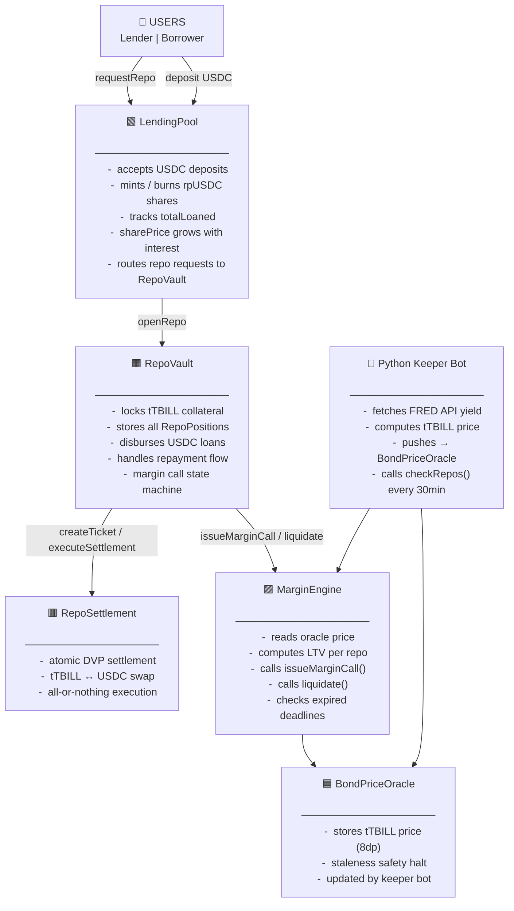
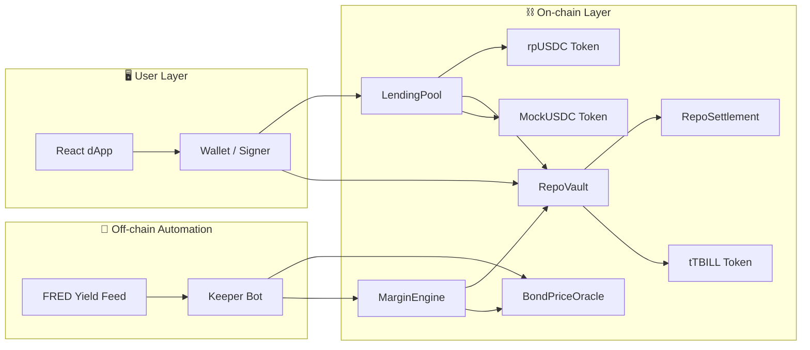
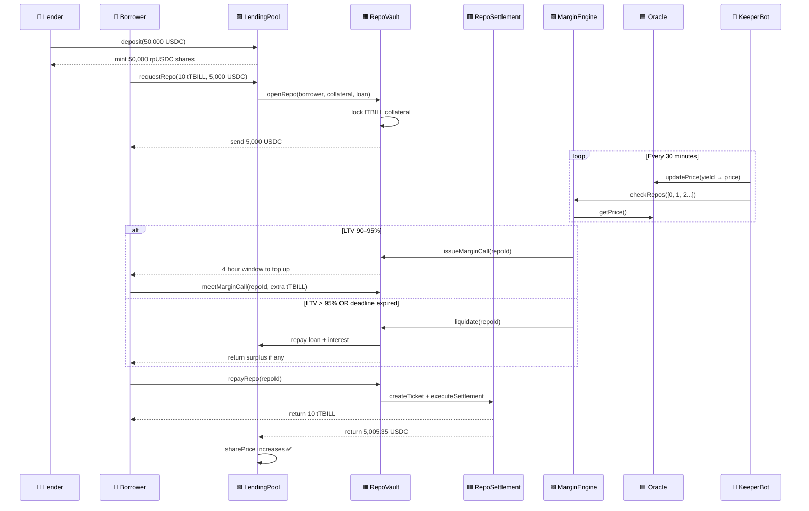
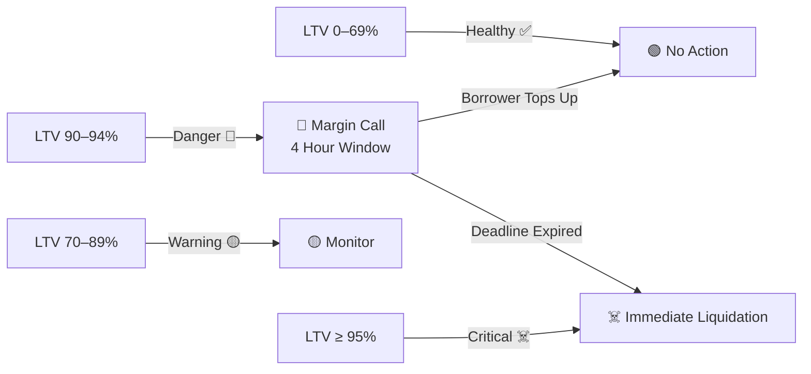
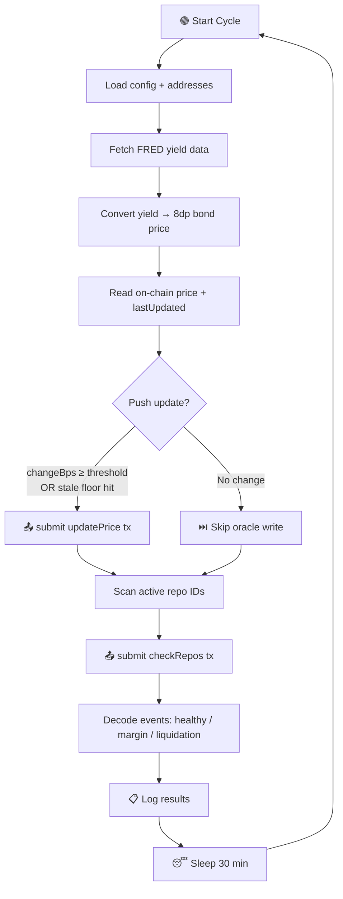

<div align="center">

# 🏛️ Wall Street Repo
### Tokenized Repo System on Ethereum

*An end-to-end on-chain repurchase agreement protocol using tokenized U.S. Treasury Bills as collateral — built for DeFi, inspired by Wall Street.*

[](https://soliditylang.org)
[](https://getfoundry.sh)
[](https://python.org)
[](https://react.dev)
[](https://sepolia.etherscan.io)
[](LICENSE)

---

> 📦 **Smart Contracts** · 🖥️ **React dApp** · 🤖 **Python Keeper Bot** · 📊 **Quant Risk Engine**

[Contracts](#-contracts) · [Architecture](#-architecture) · [Math](#-protocol-math-reference) · [Setup](#-local-setup) · [Frontend](#-frontend) · [Keeper Bot](#-keeper-bot) · [Tests](#-testing)

</div>

---

## 💡 What is a Repo?

A **Repurchase Agreement (repo)** is the backbone of global fixed-income markets.
Every day, **trillions of dollars** flow between banks, hedge funds, and central banks via repos.

```
┌─────────────────────────────────────────────────────────────┐
│                                                             │
│  Party A owns $1,000,000 in U.S. Treasury Bills            │
│                                                             │
│  TODAY:    Party A sells T-Bills to Party B for $980,000   │
│  TOMORROW: Party A buys them back for $980,100             │
│                                                             │
│  That $100 difference = repo interest (the borrowing cost) │
│                                                             │
└─────────────────────────────────────────────────────────────┘
```

**The problems in traditional repo:**
- ⏳ Settlement risk — one leg settles, the other fails
- 📋 Counterparty risk — collateral moves before risk desks react
- 🏦 Operational lag — manual checks, fragmented systems, delayed reconciliation

**This protocol fixes all three:**
- ✅ Atomic DVP via `RepoSettlement` — both legs or neither
- ✅ Deterministic LTV monitoring in `MarginEngine`
- ✅ Automated keeper bot — runs every 30 minutes, no human needed

---

## 🔭 Project Overview

Wall Street Repo is a **full-stack DeFi protocol** for institutional-grade repo lending.

| Layer | What It Does |
|---|---|
| 🟩 Smart Contracts | Collateral locking, loan accounting, margin calls, liquidation |
| 🖥️ React Frontend | Lend, borrow, repay, monitor — with live charts and multi-wallet |
| 🤖 Python Keeper | Oracle price updates from FRED API + automated margin checks |
| 📊 Quant Engine | Yield curves, haircut models, VaR stress analysis (expanding) |

### Key Protocol Parameters

| Parameter | Value |
|---|---|
| Max LTV at open | 70% (500 bps haircut) |
| Margin call threshold | 90% LTV |
| Liquidation threshold | 95% LTV |
| Margin call window | 4 hours |
| Interest convention | ACT/360 |
| Oracle update frequency | Every 5 minutes |
| Collateral token | tTBILL — ERC1400, KYC-gated, 18 decimals |
| Loan token | USDC — ERC20, 6 decimals |
| LP share token | rpUSDC — ERC20, 6 decimals |

---

## 📐 Architecture

# Basic Architecture 


# Complex Architecture



### Working Video


https://github.com/user-attachments/assets/185f0d78-00df-4ae7-a260-44fb5285f0ab


### Layered Architecture



---

## 📦 Contracts

| Contract | Address (Sepolia) | Role |
|---|---|---|
| 🪙 MockTBill (tTBILL) | `0x7B2a668e288bc8f668B709ac5558B851Cf54B113` | ERC1400 tokenized T-Bill, KYC-gated |
| 💵 MockUSDC | `0x38C56C2E22D316249BdCF8C521FEF65d5D8573b8` | Cash token, 6 decimals |
| 📊 RepoPoolToken (rpUSDC) | `0x90e48C8116b69dA6A2f353940A85829c3997aD65` | LP share token |
| 🔮 BondPriceOracle | `0xACc9099c4e9f797f1b96559007BB2a0E0A20368A` | On-chain price feed |
| 🏦 RepoVault | `0x2175633Fd0bd9D172ee36A6755e8F6A99301a347` | Collateral + position manager |
| 🏊 LendingPool | `0x3786c0952F33814A96F57a1Ee75c265E5F80e247` | USDC pool + share accounting |
| ⚙️ MarginEngine | `0x206e609B5CB8bf43FFD1ac1723bFFBd71cb99267` | LTV monitor + liquidator |
| 🔄 RepoSettlement | `0x14038cB88dc2CB86A40e1f0B79E5898aAacc1935` | Atomic DVP settlement |

---

## 🔄 Repo Lifecycle



---

## ⚙️ Risk Management



---

## 📊 Protocol Math Reference

---

### 1️⃣ Pool Accounting and Share Price

```
totalPoolValue = USDC_balance + totalLoaned

sharePrice = 1e6                                  (if totalSupply == 0)
           = (totalPoolValue × 1e6) / totalSupply (otherwise)
```

---

### 2️⃣ Deposit — USDC to Shares

```
sharesMinted = usdcAmount                              (first deposit)
             = (usdcAmount × totalSupply) / totalPoolValue  (otherwise)
```

---

### 3️⃣ Withdraw — Shares to USDC

```
usdcOut = (shareAmount × totalPoolValue) / totalSupply
```

---

### 4️⃣ Max Loan (Haircut Model)

```
maxLoan = collateralValue × (10000 - haircutBps) / 10000

Example at 5% haircut (500 bps):
  maxLoan = collateralValue × 0.95
```

---

### 5️⃣ Repo Interest (ACT/360)

```
interest  = (principal × repoRateBps × termDays) / (10000 × 360)
totalOwed = principal + interest
```

---

### 6️⃣ LTV Calculation

```
LTV_bps = 10000                              (if collateralValue == 0)
        = (loanAmount × 10000) / collateralValue  (otherwise)

LTV_%   = LTV_bps / 100
```

---

### 7️⃣ Oracle Price → USDC Collateral Value

```
usdcValue = (tokenAmount × bondPrice) / 1e20

Why:
  tokenAmount  → 18 decimals
  bondPrice    →  8 decimals
  product      → 26 decimals
  ÷ 1e20       →  6 decimals (USDC) ✅
```

---

### 8️⃣ Liquidation Split

```
surplus         = saleProceeds - loanPlusInterest
penalty         = surplus × penaltyBps / 10000
borrowerSurplus = surplus - penalty
lenderAmount    = loanPlusInterest + penalty

If saleProceeds <= loanPlusInterest:
  lenderAmount    = saleProceeds
  borrowerSurplus = 0
  penalty         = 0
```

---

### 9️⃣ Keeper — Yield to Price (Bank Discount)

```
priceUSD  = faceValue × (1 - (yield% / 100) × (termDays / 360))
price_8dp = round(priceUSD × 1e8)

Example (yield = 3.73%, 91-day T-Bill):
  priceUSD  = 1000 × (1 - 0.0373 × 91/360)
            = 1000 × 0.990576
            = $990.58
  price_8dp = 99058000000
```

---

### 🔟 Keeper — Oracle Push Decision

```
changeBps = |newPrice - oldPrice| × 10000 / oldPrice

Push oracle update when:
  changeBps >= priceChangeThresholdBps
  OR
  (now - lastUpdated) >= staleUpdateFloorSeconds
```

---

### 1️⃣1️⃣ Full Worked Example — Open → Repay

```
Given:
  Collateral    = 10 tTBILL
  Oracle price  = $980.00
  Haircut       = 5% (500 bps)
  Loan          = $5,000
  Rate          = 5.5% (550 bps)
  Term          = 7 days

Collateral value:
  10 × $980 = $9,800

Max loan check:
  $9,800 × 0.95 = $9,310
  $5,000 < $9,310 ✅ allowed

Interest:
  $5,000 × 0.055 × (7/360) = $5.35

Total owed:
  $5,000 + $5.35 = $5,005.35

After repayment — new share price:
  totalPoolValue: $50,000 → $50,005.35
  sharePrice:     $1.000000 → $1.000107
  Lender profit:  +$5.35 🟢

```

---

## 🗂️ Repository Structure

```
tokenized-repo-system/
│
├── 📁 contracts/
│   ├── src/
│   │   ├── core/
│   │   │   ├── LendingPool.sol       ← USDC pool + share accounting
│   │   │   ├── RepoVault.sol         ← Collateral vault + lifecycle
│   │   │   ├── MarginEngine.sol      ← LTV monitor + liquidation engine
│   │   │   └── RepoSettlement.sol    ← Atomic DVP settlement
│   │   ├── oracle/
│   │   │   └── BondPriceOracle.sol   ← Price feed + staleness guard
│   │   ├── tokens/
│   │   │   ├── MockTBill.sol         ← ERC1400 KYC-gated T-Bill
│   │   │   └── RepoPoolToken.sol     ← rpUSDC LP share token
│   │   └── libraries/
│   │       └── RepoMath.sol          ← All financial math
│   ├── test/
│   │   ├── LendingPool.t.sol
│   │   ├── RepoVault.t.sol
│   │   ├── MarginEngine.t.sol
│   │   └── Liquidation.t.sol
│   ├── script/
│   │   ├── Deploy.s.sol
│   │   ├── Seed.s.sol
│   │   └── AdminOps.s.sol
│   └── deployments/addresses.json
│
├── 📁 frontend/
│   └── src/
│       ├── pages/          Dashboard, Lend, Borrow, Portfolio, Admin
│       ├── components/     StatCard, RepoCard, LTVBar, Charts
│       ├── hooks/          useLendingPool, useRepoVault, useOracle
│       └── constants/      addresses.js, abis.js
│
└── 📁 risk_engine/
    ├── keeper/
    │   ├── bot.py              ← Main loop
    │   ├── price_feed.py       ← FRED API + yield→price
    │   ├── oracle_updater.py   ← Push on-chain via web3.py
    │   ├── margin_checker.py   ← checkRepos automation
    │   └── config.py           ← All tuneable parameters
    ├── pricing/                ← Quant pricing models (expanding)
    ├── risk/                   ← VaR + stress testing (expanding)
    └── notebooks/              ← Yield curve + haircut analysis
```

---

## 🚀 Local Setup

### Prerequisites

```bash
# 1. Foundry
curl -L https://foundry.paradigm.xyz | bash && foundryup
forge --version

# 2. Node 18+
node --version

# 3. Python 3.10+
python3 --version
```

### Install Everything

```bash
# Contracts
cd contracts && forge install && forge build

# Frontend
cd frontend && npm install

# Keeper
cd risk_engine && pip install -r requirements.txt
```

### Environment Variables

Create `contracts/.env`:
```env
RPC_URL=https://eth-sepolia.g.alchemy.com/v2/YOUR_KEY
PRIVATE_KEY=0x...
ETHERSCAN_API_KEY=...
FRED_API_KEY=...
```

---

## 🛠️ Contract Deployment

### 1. Deploy All Contracts

```bash
cd contracts

forge script script/Deploy.s.sol:Deploy \
  --rpc-url $RPC_URL \
  --private-key $PRIVATE_KEY \
  --broadcast

# What this does:
# ✅ Deploys all 8 contracts
# ✅ Wires trusted addresses between contracts
# ✅ Sets initial oracle price
# ✅ Grants KYC to protocol contracts
# ✅ Writes deployments/addresses.json
```

### 2. Seed Initial State

```bash
forge script script/Seed.s.sol:Seed \
  --rpc-url $RPC_URL \
  --private-key $PRIVATE_KEY \
  --broadcast

# What this does:
# ✅ Sets oracle price
# ✅ Mints demo tTBILL + USDC balances
# ✅ Deposits lender capital
# ✅ Opens a sample repo position
```

### 3. Admin Operations (KYC + Mint)

```bash
# Grant KYC + mint tokens to a user
cast send 0x7B2a668e288bc8f668B709ac5558B851Cf54B113 \
  "grantKYC(address)" <USER_ADDRESS> \
  --rpc-url $RPC_URL --private-key $PRIVATE_KEY

cast send 0x7B2a668e288bc8f668B709ac5558B851Cf54B113 \
  "mint(address,uint256)" <USER_ADDRESS> 100000000000000000000 \
  --rpc-url $RPC_URL --private-key $PRIVATE_KEY

cast send 0x38C56C2E22D316249BdCF8C521FEF65d5D8573b8 \
  "mint(address,uint256)" <USER_ADDRESS> 10000000000 \
  --rpc-url $RPC_URL --private-key $PRIVATE_KEY
```

Or use the script:
```bash
forge script script/AdminOps.s.sol --rpc-url $RPC_URL --broadcast
```

---

## 🖥️ Frontend

```bash
cd frontend
npm run dev
# Open http://localhost:3000
```

### Pages

| Page | Route | Features |
|---|---|---|
| 🏠 Dashboard | `/` | Pool stats, price chart, liquidity chart, pie chart |
| 💵 Lend | `/lend` | Deposit USDC, withdraw, share price growth chart |
| 🏦 Borrow | `/borrow` | Open repo, repay, meet margin call, LTV health bar |
| 👤 Portfolio | `/portfolio` | Balances, positions, PnL, net worth chart |
| 🔑 Admin | `/admin` | KYC grant, mint tokens, oracle update, diagnostics |

### Wallet Support

Powered by **Web3Modal + Wagmi**:

```
MetaMask · Coinbase Wallet · WalletConnect
Rainbow · Trust Wallet · Ledger · Phantom · 300+ more
```

Get your free WalletConnect Project ID at [cloud.walletconnect.com](https://cloud.walletconnect.com)

### Charts (Recharts)

| Chart | Page |
|---|---|
| 📈 tTBILL Price History | Dashboard |
| 🏊 Pool Liquidity Over Time | Dashboard |
| 🥧 Pool Composition (available/loaned) | Dashboard |
| 📈 rpUSDC Share Price Growth | Lend |
| 📉 LTV History per Repo | Borrow |
| 💼 Net Worth Over Time | Portfolio |

---

## 🤖 Keeper Bot

```bash
cd risk_engine/keeper
python3 -m venv venv && source venv/bin/activate
pip install -r requirements.txt

# Run once
python3 bot.py --once

# Run continuously (every 30 min)
python3 bot.py
```

### Keeper Cycle



Sample log output:
```
2026-03-21 06:16:03 | INFO | 🤖 Keeper bot started. interval=1800s
2026-03-21 06:16:05 | INFO | FRED yield=3.73% → price=$990.58
2026-03-21 06:16:06 | INFO | Oracle update skipped (Δ=0.00bp < threshold=10bp)
2026-03-21 06:16:11 | INFO | checkRepos( [ppl-ai-file-upload.s3.amazonaws](https://ppl-ai-file-upload.s3.amazonaws.com/web/direct-files/attachments/83277269/432123c8-b578-4571-bdeb-7fd0723a5604/paste.txt)) → healthy=2 margin_calls=0 liquidations=0
```

---

## 🧪 Testing

```bash
cd contracts

# Run all tests
forge test -vvvv

# Individual suites
forge test --match-path test/LendingPool.t.sol -vvvv
forge test --match-path test/RepoVault.t.sol -vvvv
forge test --match-path test/MarginEngine.t.sol -vvvv
forge test --match-path test/Liquidation.t.sol -vvvv

# Single test
forge test --match-test test_fullLifecycle_depositBorrowRepayWithdraw -vvvv

# Coverage
forge coverage --ir-minimum
```

### Test Coverage

| Suite | Tests | What's Covered |
|---|---|---|
| `LendingPool.t.sol` | 10 | Deposit, withdraw, share price, liquidity checks |
| `RepoVault.t.sol` | 10 | Open, repay, collateral value, LTV safety |
| `MarginEngine.t.sol` | 8 | Healthy, margin call, liquidation, access control |
| `Liquidation.t.sol` | 8 | Full liquidation, shortfall, surplus, lifecycle |

---

## 🔐 Security Notes

### Solidity Patterns Used

- ✅ **CEI ordering** — checks-effects-interactions on all state transitions
- ✅ **ReentrancyGuard** — on all external action methods
- ✅ **Role-gated admin ops** — owner-only oracle writes, KYC, minting
- ✅ **Pause controls** — emergency stop mechanism
- ✅ **One-time wiring guards** — trusted addresses set once at deploy
- ✅ **Oracle staleness halt** — protocol freezes on stale feed

---

## 🔮 Production Roadmap

| Priority | Upgrade |
|---|---|
| 🔴 Critical | Replace MockTBill with regulated RWA: **BlackRock BUIDL**, **Ondo OUSG**, **Franklin BENJI** |
| 🔴 Critical | Replace FRED keeper with **Chainlink Functions** for decentralised oracle |
| 🟡 High | Add DEX/RFQ integration for liquidation collateral sale |
| 🟡 High | Multisig + timelock governance for admin functions |
| 🟢 Medium | **The Graph** subgraph for event indexing + chart data |
| 🟢 Medium | Formal invariant + fuzz testing on accounting paths |
| 🟢 Medium | EIP-2612 permit to remove two-step approve + deposit |
| 🔵 Future | Full quant modules: haircut calibration, VaR, crisis scenario replay |

---

## 🧠 Concepts Demonstrated

| Concept | Implementation |
|---|---|
| Repurchase Agreement | Full open → repay → margin call → liquidation lifecycle |
| Tokenized RWA | ERC1400 tTBILL with CUSIP `US912796YT68` metadata |
| KYC-Gated Security Token | ERC1400 transfer restrictions — both parties must be whitelisted |
| Share-Based Lending Pool | rpUSDC share price grows with interest — like Aave/Compound |
| Atomic DVP Settlement | RepoSettlement — both legs or neither, zero counterparty risk |
| Automated Market Risk | MarginEngine + keeper bot replicates a real repo risk desk |
| On-Chain Price Oracle | BondPriceOracle with staleness safety halt |
| Bank Discount Yield Formula | FRED yield → T-Bill price → on-chain 8dp representation |

---

<div align="center">

Built by **Aditya Kumar Mishra**

*"If Wall Street ran on Ethereum, it would look something like this."*

[](LICENSE)

</div>
